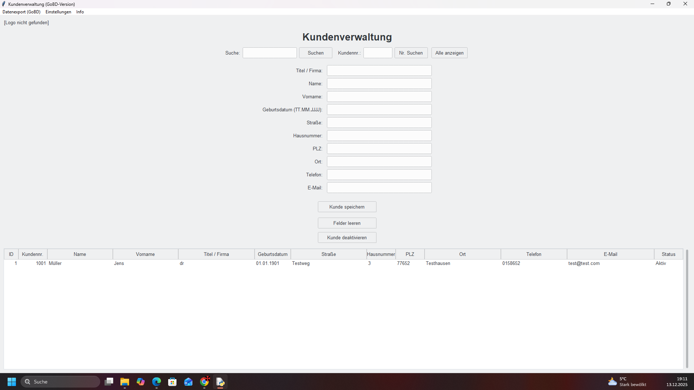
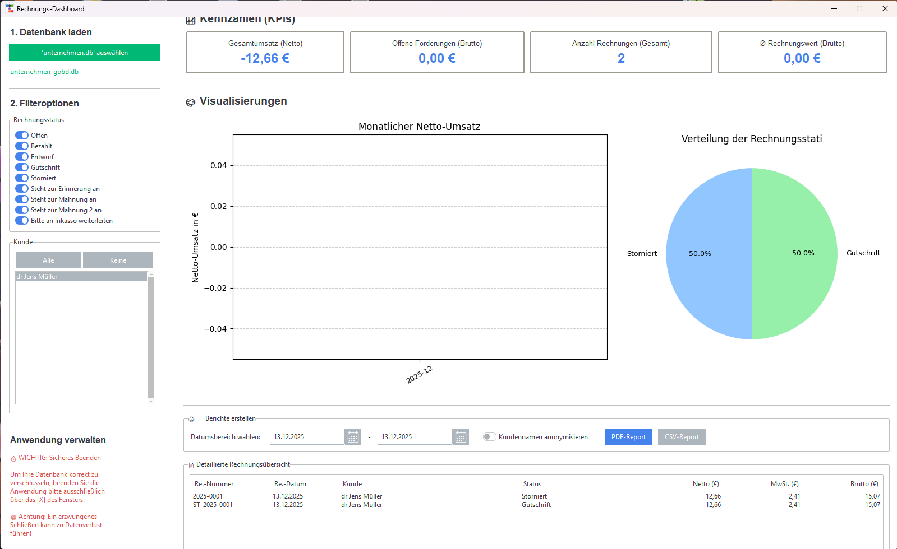
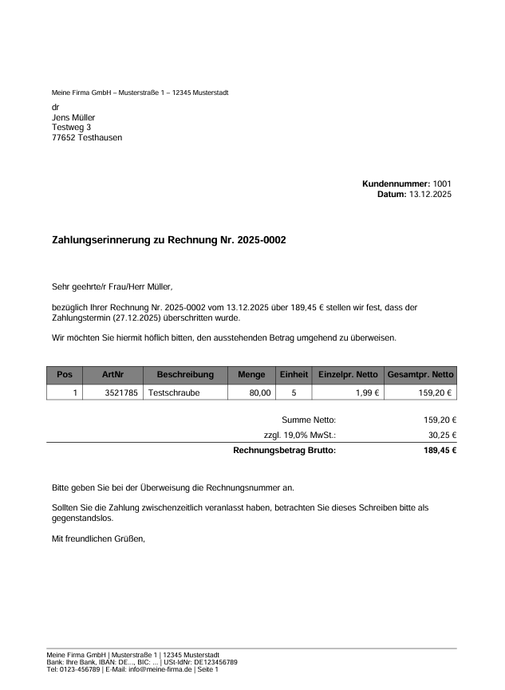
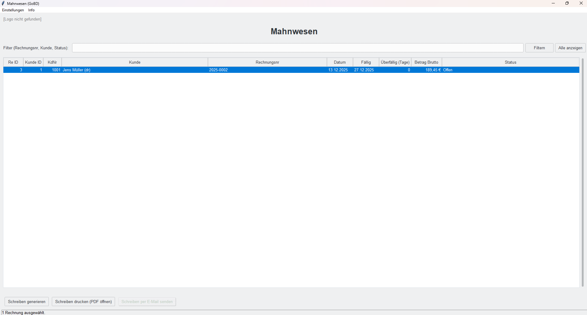

# Phoenix-ERP: Eine freie ERP-Suite für den Mittelstand

**Eine quelloffene, modulare ERP-Lösung für kleine Unternehmen, Handwerker und Freiberufler – geboren aus der Überzeugung, dass professionelle Werkzeuge frei und zugänglich sein sollten.**

### Screenshot-Galerie

| Launcher & Sicherheit | Kunden & Rechnungen |
| :---: | :---: |
|  |  |
|  |  |

| GoBD & Mahnwesen | Dashboard |
| :---: | :---: |
|  |  |
|  |  |

---

## 🔥 Die Vision: "Einfach weil 'Einfach' einfach ist."

In einer Welt voller komplexer, teurer und restriktiver Unternehmenssoftware stellt sich dieses Projekt eine einfache Frage: Muss das so sein?

Die Antwort ist ein klares Nein. Phoenix-ERP ist meine Antwort auf diese Frage. Es ist kein Versuch, Giganten wie SAP zu kopieren. Es ist der Versuch, sie für die meisten Unternehmen überflüssig zu machen. Es konzentriert sich auf die Kernfunktionen, die wirklich gebraucht werden, verpackt in einer sauberen, schnellen und lokalen Desktop-Anwendung. Keine Cloud-Abhängigkeit, keine monatlichen Gebühren, keine künstlichen Schranken.

## ✨ Features im Überblick

Phoenix-ERP ist eine modulare Suite. Jedes Tool ist eine eigenständige Anwendung, die sich auf eine Aufgabe konzentriert, aber alle arbeiten auf einer gemeinsamen, verschlüsselten Datenbank.

*   **Kundenverwaltung (CRM):** Vollständige Verwaltung von Kundendaten inklusive eines integrierten Dokumentenmanagements.
*   **Rechnungswesen:** Erstellen und verwalten Sie Angebote, Rechnungen und Gutschriften.
*   **Lagerverwaltung (Warenwirtschaft):** Behalten Sie den Überblick über Ihre Artikel und Bestände.
*   **Automatisiertes Mahnwesen:** Ein intelligentes, mehrstufiges System zur Überwachung und Verwaltung offener Forderungen.
*   **GoBD-fähig:** Entwickelt nach deutschen Grundsätzen der ordnungsmäßigen Buchführung (revisionssicheres Audit-Log, keine Löschung von Kerndaten, Finalisierung von Belegen).
*   **XRechnung-Generator:** Erstellen Sie konforme elektronische Rechnungen für öffentliche Auftraggeber.
*   **Business-Intelligence-Dashboard:** Verwandeln Sie Ihre Daten in verständliche KPIs und Grafiken, um Ihr Geschäft besser zu verstehen.
*   **Sicherheit durch Design:** Eine zentrale, AES-verschlüsselte Datenbank dank des `DatenSchloss`-Moduls. Ihre Daten gehören Ihnen – und nur Ihnen.
*   **Proaktiver `Bestandswächter`:** Ein stiller Helfer in der Taskleiste, der Sie warnt, bevor Lagerbestände kritisch werden.
*   **Einheitlicher `Launcher`:** Ein sauberer, zentraler Startpunkt für alle Module der Suite.

## 🛠️ Die Entstehungsgeschichte: Der Architekt, nicht der Programmierer

Dieses Projekt wurde nicht in einem Konferenzraum geboren, sondern auf meinem Esstisch. Es begann mit einer Vision: Software zu schaffen, die dient, anstatt zu beschränken.

Mein Weg ist nicht der eines klassischen Entwicklers. Ich komme aus dem IT-Support, angetrieben von der Freude am Lösen von Problemen. Dieses gesamte, komplexe System wurde nicht Zeile für Zeile von mir getippt. Stattdessen habe ich meine Rolle als Architekt und Projektleiter eingenommen. 
Moderne KI-Werkzeuge waren dabei meine unermüdlichen "Junior-Programmierer", die meine Visionen, meine Architektur, die Designs und meine unzähligen Korrekturen in funktionierenden Code umgesetzt haben.

Dieses Projekt ist der lebende Beweis, dass die Zukunft der Softwareentwicklung nicht mehr nur im Tippen von Code liegt, sondern in der Vision, im Design, im Testen und in der Fähigkeit, moderne KI- Werkzeuge zu dirigieren.

## 🚀 Erste Schritte (Installation)

Dieses Projekt ist eine Desktop-Anwendung für Windows.

1.  **Repository herunterladen:**
    Laden Sie dieses Repository als ZIP-Datei herunter und entpacken Sie es.

2.  **Abhängigkeiten installieren:**
    Stellen Sie sicher, dass Sie Python auf Ihrem System installiert haben. Öffnen Sie eine Kommandozeile (`cmd`) im Projektordner und führen Sie aus:
    
    pip install -r requirements.txt
    

3.  **Starten:**
    Starten Sie die Suite über den Launcher. Ein Doppelklick auf die `Launcher.pyw`-Datei genügt.

## 🤝 Wie du mitwirken kannst

Dieses Projekt ist ein Geschenk. Und jedes Geschenk wird wertvoller, wenn es geteilt und gemeinsam weiterentwickelt wird.

*   **Fehler gefunden?** Bitte erstelle ein "Issue" – du hilfst uns allen damit.
*   **Eine Idee für ein neues Feature?** (DATEV-Export, Angebots-Modul...) Lass uns im "Discussions"-Tab darüber reden!
*   **Du willst Code beisteuern?** Fantastisch! Erstelle einen "Pull Request". Jede Hilfe ist willkommen.

## 🙏 Danksagung & Projektphilosophie

Dieses Projekt ist das Ergebnis einer Vision, die durch den Einsatz moderner KI-Werkzeuge Wirklichkeit werden konnte. Es ist ein Beispiel für Selbstverwirklichung und den Wunsch, nützliche und freie Software für alle zugänglich zu machen.

Mein aufrichtiger Dank gilt den Entwicklern und Forschern, deren Arbeit diese Werkzeuge ermöglicht hat. In diesem Projekt fungierten sie als unermüdliche digitale Assistenten, die den Code schrieben, während die Vision, die Architektur und die Leitung des Projekts in meiner Verantwortung lagen. Gott sei Dank konnte ich dadurch meine persönlichen Ressourcen hauptsächlich auf Design- und Architekturfragen, die Funktionsweisen und den Inhalt der Software konzentrieren, anstatt mühevoll Codezeile für Codezeile selbst zu schreiben.

Ich bin zutiefst dankbar für die Möglichkeit, meine Ideen auf diese Weise umsetzen zu können. Dieses Projekt soll ein Beweis dafür sein, wie Leidenschaft und moderne Technologie zusammenkommen können, um nützliche und offene Alternativen zu schaffen.

Manuel Person

## 📜 Lizenz

Dieses Projekt steht unter der **MIT-Lizenz**. Das bedeutet, du kannst damit fast alles machen, solange du meinen Namen als ursprünglichen Autor nennst. Lies die `LICENSE`-Datei für die Details.
